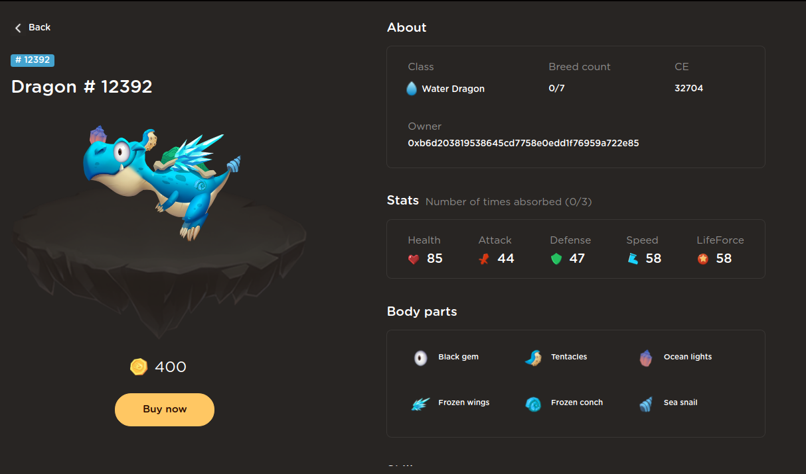
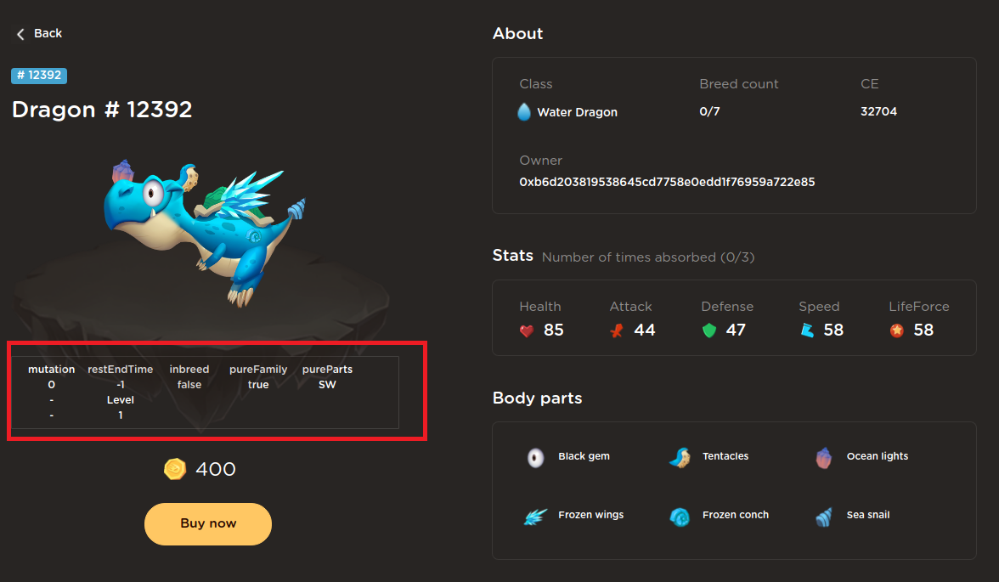

# DragonmainlandExtension
Chrome browser extension to aid game play for https://dragonmainland.io/

## Installation Steps
1. Browse to `chrome://extensions/` on your Chrome browser
2. Drag and drop the CRX file downloaded from Release into the browser

## Usage
Browsing to https://dragonmainland.io/#/myMainland/myDragonDetail/xxxxxx of any dragons will see an additional overlay which exposes hidden/additional attributes
  
### Before Installation

### After Installation

| Label | Description |
| --- | ----------- |
| CE | Combat Effectiveness (hashpower)
| boneCount | Number of bone absorbed |
| mutation | Value of mutation |
| restEndTime | Countdown timer to next breeding |
| inbreed | Check for repeated family members in the dragon's entire family line. E.g. no inbreed - if dragons in family line are unique  |
| pureBreed | Check to see if the dragons in the entire family line belong to 1 race|
